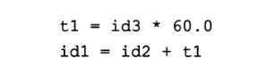
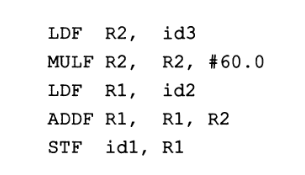

## Идентификатор
ассемблер (eng: assembler)

## Определение
Ассемблер - программа, которая транслирует программу, написанную на низкоуровневом языке или языке ассемблера на машинный код.

[Источник.](https://helpiks.org/6-25044.html)

## Примечание
Ассемблер - языковой процессор.

Компьютер понимает инструкции на машинном коде (то есть на языке нулей и единиц). Ассемблер является первым интерфейсом,
который позволяет общаться человеку с машиной.

Код на языке ассемблера содержит такие инструкции как ADD, MUL, MUX, SUB, DIV, MOV и другие.

Язык ассемблера является платформенно-зависимым языком низкого уровня.

[Источник.](https://www.geeksforgeeks.org/language-processors-assembler-compiler-and-interpreter/)

Каждая команда в программе, написанной на ассемблере, имеет почти взаимно-однозначное соответствие командам в машинном коде.

Каждая инструкция на языке высокого уровня имеет намного более сложную связь с машинным кодом, чем ассемблер, поэтому в
ассемблере пишутся программы тогда, когда желательно использовать компьютерные аппаратные средства более эффективно.

[Источник.](https://helpiks.org/6-25044.html)

## Пример
Промежуточный код
</img>

Промежуточный код, транслированный в машинный код
</img>

[Источник (Глава 1. Раздел 2).](../bibliography/Aho-Compilers-book.md)

## Преимущества
- Высокая производительность
- Минимальное количество избыточного кода

## Недостатки
- Большие объёмы кода
- Код на языке ассемблера сложно читается и поддерживается
- Легко допустить ошибку
- Малая совместимость

## Обратное по функционалу понятие
Дизассемблер - транслятор, преобразующий машинный код в текст программы на языке ассемблера.

Бывают автоматические и интерактивные дизассемблеры.

## Связанные понятия
[Языковой процессор](language_processor.md)

[Машинный код](machine_code.md)

[Язык низкого уровня](low_level_language.md)

[Язык высокого уровня](high_level_language.md)
