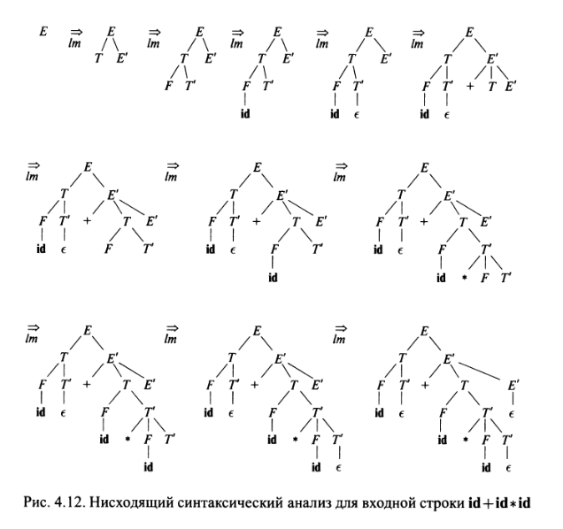

## Идентификатор
нисходящий синтаксический анализатор (eng: bottom up syntactic analyzer)

## Определение
Нисходящий синтаксический анализатор -- синтаксический анализатор, который строит дерево разбора сверху (от корня) вниз 
(к листьям), сканируя входной поток символов слева направо.

[Источник.(Глава 4. Раздел 1.)](../bibliography/Aho-Compilers-book.md)

## Достоинства
- Эффективность работы алгоритма

## Недостатки
- Неспособность обработки любой грамматики

## Пример

## Связанные понятия
[Cинтаксический анализатор](syntactic_analyzer.md)

[Восходящий синтаксический анализатор](top_down_syntactic_analyzer.md)

[Универсальный синтаксический анализатор](universal_syntactic_analyzer.md)
