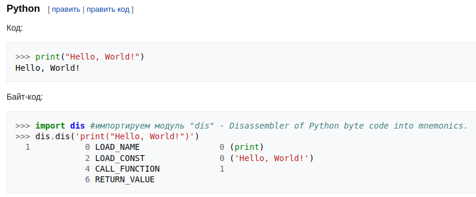

## Идентификатор
байт-код (eng: bytecode)

## Определение
Байт-код - машинно-независимый код низкого уровня, генерируемый транслятором из исходного кода.

[Источник.](https://ru.wikipedia.org/wiki/%D0%91%D0%B0%D0%B9%D1%82-%D0%BA%D0%BE%D0%B4)

## Примечание
Байт-код — это компактное представление программы, уже прошедшей синтаксический и семантический анализ.

Исходная программа на Java может перед интерпретацией компилироваться в байт-код. 

Байт-код либо интерпретируется, либо компилируется в машинный код динамически в процессе выполнения.

Байт-код включает детальную информацию о типах операций и перед выполнением проходит проверку на ошибки.

[Источник (Глава 1. Раздел 5).](../bibliography/Aho-Compilers-book.md)

Байт-код использует набор инструкций виртуального процессора.

Возможно создание процессоров, для которых определённый байт-код является непосредственно машинным кодом.

## Преимущества
- Скомпилированный на одном компьютере байт-код может быть выполнен на другом, например, будучи передан по сети
- Облегчение и ускорение работы интерпретатора (на десятки процентов)

## Недостатки
- Ошибки верификации байт-кода стековых машин приводили к экстремальным уязвимостям
- Байт-код сложнее для проведения оптимизаций

## Примеры языков, использующих байт-код
- Java
- C#
- Perl
- PHP
- Ruby
- Python
- Forth

## Пример на языке Python
</img>

[Источник.](https://ru.wikipedia.org/wiki/%D0%91%D0%B0%D0%B9%D1%82-%D0%BA%D0%BE%D0%B4)

## Связанные понятия
[Интерпретатор](interpreter.md)

[Компилятор](compiler.md)

[Машинный код](machine_code.md)

[Виртуальная машина](virtual_machine.md)