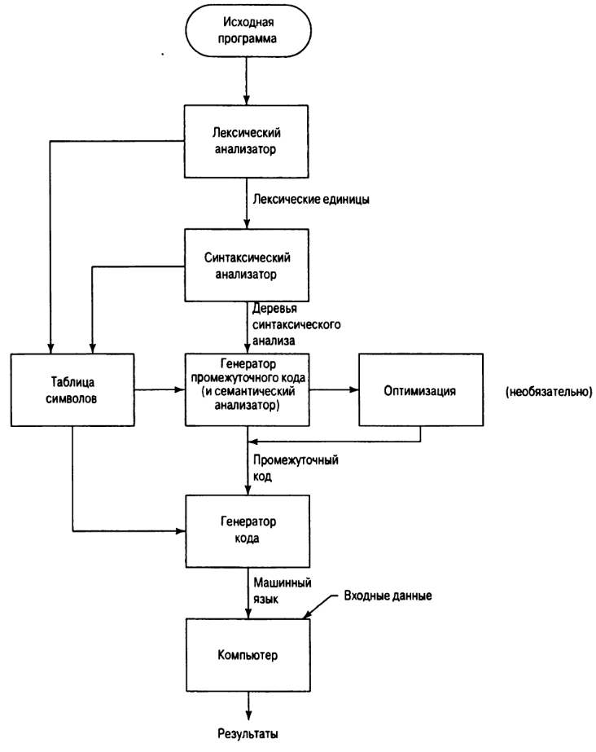

## Идентификатор
компилятор (eng: compiler)

## Определение
Компилятор - это программа, которая преобразует текст программы на язык низкого уровня.

[Источник (Глава 1. Раздел 1).](../bibliography/Sebesta-Concepts-book.md)

## Примечание
Компилятор - вид языкового процессора.

Исходный код не может быть напрямую выполнен компьютером, поэтому он должен конвертироваться в машинный код.

Машинный язык выступает в качестве языка низкого уровня, который непосредственно выполняется компьютером.

Компилятор также может оптимизировать код для более быстрого выполнения и меньшего потребления памяти.

Компилятор сообщает об ошибках в исходной программе, обнаруженных в процессе трансляции.

## Процесс компиляции

[Источник (Глава 1. Раздел 7).](../bibliography/Sebesta-Concepts-book.md)

## Преимущества
- Целевая программа, производимая компилятором, обычно выполняется гораздо быстрее, чем интерпретация
- Высокая безопасность

## Недостатки
- Платформенная зависимость машинного кода, полученного в результате компиляции
- Требует больше времени на анализ исходного кода

## Типы компиляторов
- Однопроходные
- Многопроходные

## Примеры компилируемых языков
- C
- C++
- C#
- Go
- Swift
- Delphi

## Связанные понятия
[Языковой процессор](language_processor.md)

[Интерпретатор](interpreter.md)

[Транслятор](translator.md)

[Исходный код](source_code.md)

[Язык низкого уровня](low_level_language.md)

[Однопроходный компилятор](single_pass_compiler.md)

[Многопроходный компилятор](multi_pass_compiler.md)
