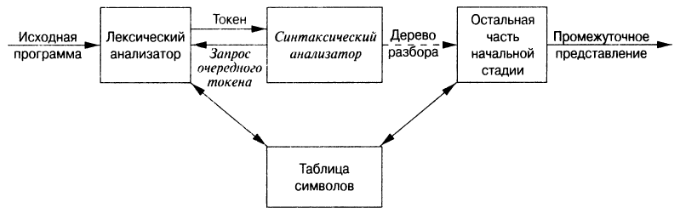

## Идентификатор
синтаксический анализатор (eng: syntax analyzer)

## Определение
Синтаксический анализатор — это транслятор, являющийся частью компилятора, в котором исследуется входная цепочка лексем,
полученная лексическим анализатором, и устанавливается, удовлетворяет ли она структурным условиям, явно сформулированным 
в определении синтаксиса языка, в виде синтаксического дерева разбора.

[Источник.(Глава 4. Раздел 1.)](../../../../bibliography/Aho-Compilers-book.md)

## Примечание
Синтаксис языка программирования - это форма его выражений, операторов и программных единиц.

Синтаксические правила языка определяют, какие именно строки, состоящие из символов алфавита, существуют в языке.

Для определения синтаксиса языка программирования используется грамматика.

По совокупности синтаксических правил можно автоматически построить синтаксический анализатор, который будет проверять,
имеет ли исходная программа синтаксическую структуру, определяемую этими правилами.

Какова синтаксическая структура цепочки лексем, существенно знать также и при генерации кода.

## Задачи
- должен ясно и точно сообщать о наличии ошибок;
- должен обеспечивать быстрое восстановление после ошибки, чтобы продолжать поиск других ошибок;
- должен существенно замедлять обработку корректной входной цепочки.

## Фаза синтаксического анализатора

## Классификация синтаксических анализаторов
- [универсальный синтаксический анализатор](universal_lexical_analyzer.md);
- [восходящий синтаксический анализатор](top_down_lexical_analyzer.md);
- [нисходящий синтаксический анализатор](bottom_up_lexical_analyzer.md).

## Синоним
Парсер (ang: parser)

## Связанные понятия
[Синтаксический анализ](syntax_analysis.md)

[Синтаксис языка](language_syntax.md)

[Синтаксическое дерево разбора](parse_tree.md)

[Компилятор]()

[Лексический анализатор](../lexical_analysis/lexical_analyzer.md)
