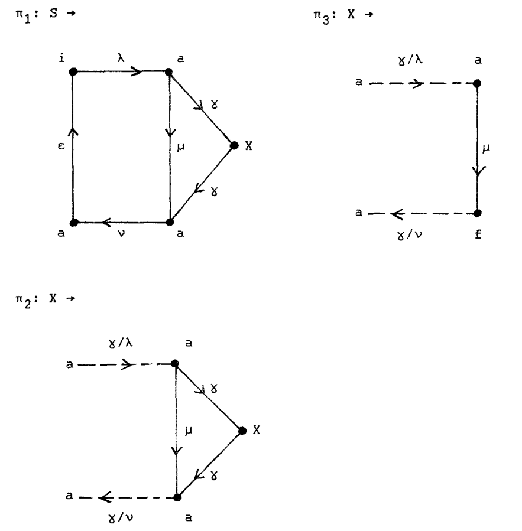

## Идентификатор

ednce_грамматика (eng: ednce_graph_grammar)

## Определение

edNCE грамматика - кортеж (Σ, △, Г, Q, P, S), где Σ - алфавит ярлыков узлов, △ ⊆ Σ - алфавит терминалов ярлыков узлом, Г - алфавит ярлыков ребер, Q ⊆ Г - алфавит терминалов ярлыков ребер, P - конечное множество продукций графа, S - стартовый нетерминал.

## Пример

Σ = {S,X,i,a,f}, △ = {i,a,f}, Г = {➰,λ,μ,v,ε}, Q = {λ,μ,v,ε}
P состоит из правил: 

## Связь с другими понятиями

1. [правило_преобразования](embedding_transformation.md)
2. [продукция_графовой_грамматики](graph_grammar_production.md)
3. [графовая_грамматика](graph_grammar.md)

## Библиография

1. Survey of Graph Rewriting applied to Model Transformations. Francisco de la Parra and Thomas Dean
2. Context-free NCE Graph Grammars. Joost Engelfriet, Leiden University.

