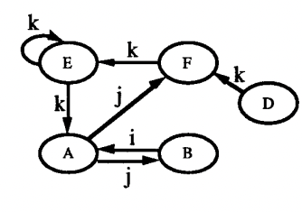
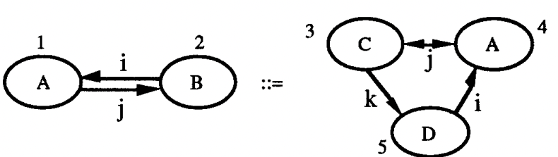
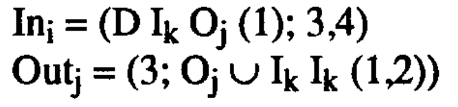
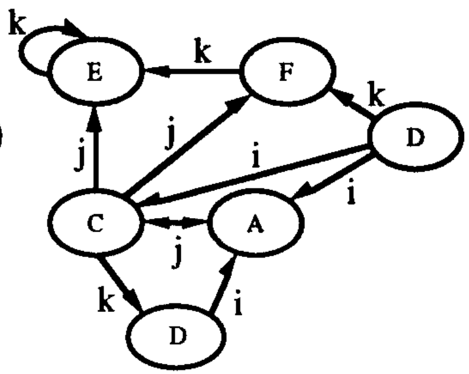

## Идентификатор

графовая_грамматика (eng: graph_grammar)

## Определение

Графовой грамматикой называется четверка (T, N, P, S), где T - множество терминалов, N - множество нетерминалов, P - множество правил вида L -> R, причем L – непустая последовательность  терминальных  и  нетерминальных  символов,  содержащая хотя бы один нетерминальный символ, R – любая последовательность терминальных и нетерминальных символов, S - стартовый начальный символ.

## Пояснение

Графовая грамматика содержит правила, которые состоят из левой и правой частей. Правила применяются для исходного графа, называемого хостом. Если подграф в левой части правила был найден в исходном графе, то правило может быть применено. Применение правила означает замену найденного в хосте подграфа графом, расположенным в правой части правила.

Таким образом, чтобы задать графовую грамматику нужно:

1. Исходный граф, который называется хостом
2. Множество правил, в виде (g1, g2, E).

Очень часто исходный граф и правила задаются в графической форме.

Графовая грамматика бывает нескольких типов

1. NLC грамматика
2. NCE грамматика
3. edNCE грамматика

## Применение

1. _Моделирование и анализ вычислительных сетей_. Графы являются удобным средством моделирования вычислительных сетей. Графовые грамматики могут использоваться для представления структуры сложной сетевой модели
2. _Технология производства программного обеспечения_. При разработке программных систем используются различные виды диаграмм: описание архитектуры системы, диаграммы потоков, диаграммы прецедентов и др. Графовые грамматики могут применяться для формального определения диаграммных языков моделирования.
3. _Разработка компиляторов_. Графы применяются для представления логической структуры программы. Теория графовых грамматик может применяться для оптимизации программ и при разработке трансляторов. Кроме того, графовые грамматики могут применяться для описания двухмерных языков программирования, позволяющих представить программу в графическом виде. Известным примером такого представления программы является блок-схема.
## Пример

Граф хост:

Правило 1: 

Преобразование включения для правила 1:

Таким образом, при применении правила 1, получится:

## Связь с другими понятиями

1. [правило_преобразования](embedding_transformation.md)
2. [продукция_графовой_грамматики](graph_grammar_production.md)
3. [nlc_грамматика](nlc_graph_grammar.md)
4. [nce_грамматика](nce_graph_grammar.md)
5. [ednce_грамматика](ednce_graph_grammar.md)

## Библиография

1. Использование графовых грамматик для трансформации моделей. Александр Сухов, Александр Серый.
2. A survey of graph grammars: theory and applications, Hoda Fahmy, University of Toronto.
