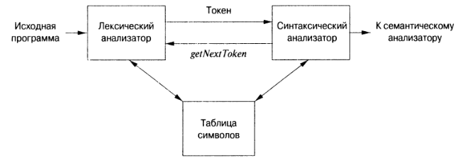

## Идентификатор
лексический анализатор (eng: lexical analyzer)

## Определение
Лексический анализатор -- это транслятор, являющийся частью компилятора, входом которого служит цепочка символов 
некоторого алфавита и который группирует терминальные символы в ней в единые синтаксические объекты, называемые лексемами.

[Источник.](../bibliography/Aho-Compilers-book.md)

## Примечание
Лексический анализатор позволяет синтаксическому анализатору работать с многосимвольными конструкциями наподобие 
идентификаторов, которые записываются как последовательность символов, но рассматриваются как единицы трансляции, 
называющиеся токенами.

Лексический анализатор считывает символы исходной программы, группирует их в лексически осмысленные единицы, которые 
называются лексемами, и в качестве выходных данных возвращает токены, представляющие эти лексемы.

Для каждой лексемы анализатор строит выходной токен.

Лексический анализатор иногда должен заглядывать вперед за интересующую его в данный момент лексему.

## Синоним
токенизатор (eng: tokenizer)

## Задачи
- Отбрасывание пробельных символов (пробел, символы табуляции и новой строки, а также, возможно, некоторые другие 
символы, использующиеся для отделения токенов друг от друга во входном потоке);

- Cинхронизация сообщений об ошибках, генерируемых компилятором, с исходной программой (например, отслеживание 
количества символов новой строки, чтобы каждое сообщение об ошибке сопровождалось номером строки, в которой она 
обнаружена).

## Подходы к лексическому анализу
- Говорят, что лексический анализатор работает прямо, если для данного входного текста (цепочки) и положения указателя
   в этом тексте анализатор определяет лексему, расположенную непосредственно справа от указываемого места, и сдвигает
   указатель вправо от части текста, образующей эту лексему.
- Говорят, что лексический анализатор работает не прямо, если для данного текста, положения указателя в этом тексте
   и типа лексемы он определяет, образуют ли знаки, расположенные непосредственно справа от указателя, лексему этого 
   типа. Если да, то указатель передвигается вправо от части текста, образующей эту лексему.

## Схема взаимодействия лексического и синтаксического анализаторов

## Связанные понятия
[Лексема](lexeme.md)

[Токен](token.md)

[Терминальный символ](terminal_symbol.md)

[Синтаксический анализатор](syntactic_analyzer.md)

[Лексическая ошибка](lexical_error.md)

[Компилятор](compiler.md)

[Транслятор](translator.md)
