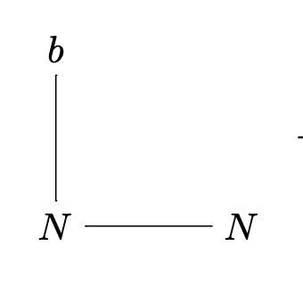
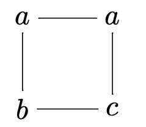
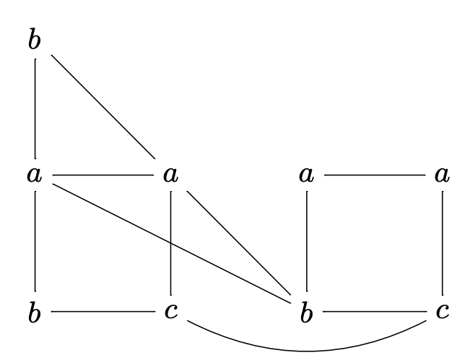

## Идентификатор

nlc_грамматика (eng: nlc_graph_grammar)

## Определение

NLC грамматика - кортеж (NU, P, C, S), где NU - еще один кортеж (V, E, Σ, L), где 
V - конечное множество узлов, E - множество ненаправленных ребер, Σ - конечный алфавит символов (терминалов и нетерминалов), V -> Σ - функция образования ярлыков, которая назначает каждому узлу терминал или нетерминал. P - множество продукций графовой грамматики, С - отношение связей, пара (a, b) в этом отношении означает, что ребро должно быть создано между узлом a графа g1 и узлом b графа g2, S - стартовый граф.

## Пояснение

Механизм замены и включения в NLC грамматиках строго локальны к окрестности одного узла.

## Пример

Граф NU

Правило N -> S (E)
E = {(a, b),(b, a),(c, c),(a, N),(c, N)

S:

Получившийся граф:

## Связь с другими понятиями

1. [правило_преобразования](embedding_transformation.md)
2. [продукция_графовой_грамматики](graph_grammar_production.md)
3. [графовая_грамматика](graph_grammar.md)

## Библиография

1. Survey of Graph Rewriting applied to Model Transformations. Francisco de la Parra and Thomas Dean
2. Learning Non-Confluent NLC Graph Grammar Rules. Kendrik Blockeel and Robert Brijder
