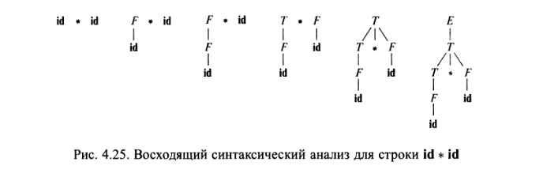

## Идентификатор
восходящий синтаксический анализатор (eng: top down syntactic analyzer)

## Определение
Восходящий синтаксический анализатор -- синтаксический анализатор, который строит дерево разбора снизу (от листьев) 
вверх (к корню), сканируя входной поток символов слева направо.

[Источник. (Глава 4. Раздел 1).](../bibliography/Aho-Compilers-book.md)

## Достоинства
- Эффективность работы алгоритма

## Недостатки
- Неспособность обработки любой грамматики

## Пример

## Связанные понятия
[Cинтаксический анализатор](syntactic_analyzer.md)

[Нисходящий синтаксический анализатор](bottom_up_syntactic_analyzer.md)

[Универсальный синтаксический анализатор](universal_syntactic_analyzer.md)
