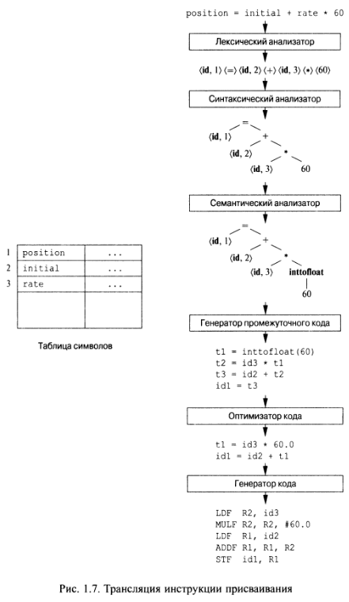

## Идентификатор
транслятор (eng: translator)

## Определение
Транслятор - это программа, которая переводит программу одного языка на эквивалентную ей программу другого языка.

[Источник.](https://www.computerhope.com/jargon/l/langproc.htm#:~:text=A%20language%20processor%20is%20a,such%20as%20Fortran%20and%20COBOL.)

## Примечание
Трансляция программы - преобразование программы, представленной на одном из языков программирования, в программу на другом языке.

Транслятор может переводить код поданной на вход программы в машинный код, позволяя компьютеру читать и понимать, какие 
задачи должна выполнять программа в своем родном коде.

Разница между интерпретатором и транслятором в том, что интерпретатор говорит компьютеру, что делать, 
а транслятор позволяет компьютеру самому понять, что делать.
[Источник.](https://www.computerhope.com/jargon/l/langproc.htm#:~:text=A%20language%20processor%20is%20a,such%20as%20Fortran%20and%20COBOL.)

Язык, на котором представлена входная программа, называется исходным языком, а сама программа — исходным кодом. 
Выходной язык называется целевым языком.

Транслятор использует таблицу символов для отслеживания зарезервированных слов и уже обработанных идентификаторов.

Методы компиляции могут использоваться для трансляции бинарного кода для одной машины в код для другой, обеспечивая
выполнение машиной программы, изначально скомпилированной для другого набора машинных команд (бинарная трансляция).
[Источник (Глава 1. Раздел 5).](../bibliography/Aho-Compilers-book.md)

## Примеры трансляторов
[Ассемблер](assembler.md)

[Компилятор](compiler.md)

## Пример
</img>

[Источник (Глава 1. Раздел 1).](../bibliography/Aho-Compilers-book.md)

## Связанные понятия
[Языковой процессор](language_processor.md)

[Компилятор](compiler.md)

[Интерпретатор](interpreter.md)

[Лексический анализатор](lexical_analyzer.md)

[Машинный код](machine_code.md)

[Язык программирования](programming_language.md)
