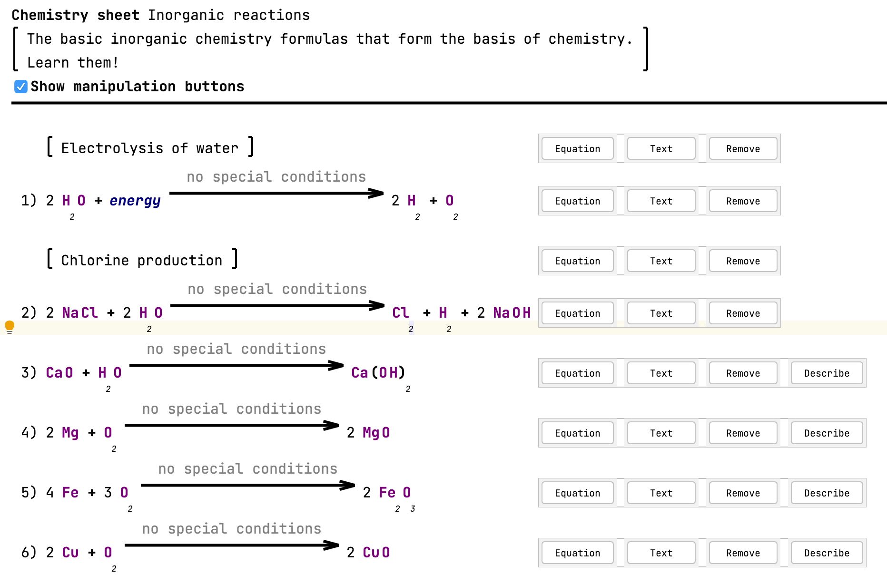
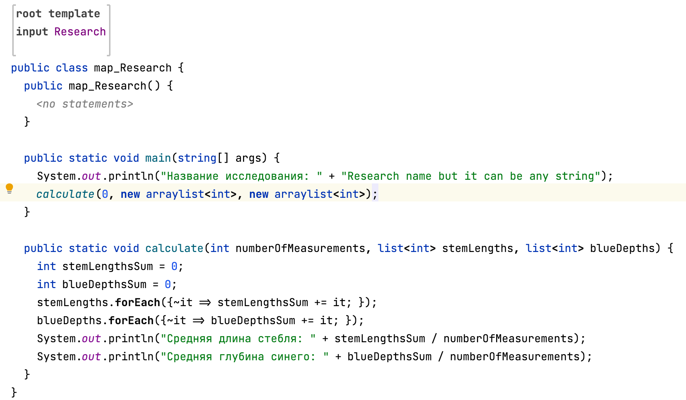

# JetBrains MPS guide

[https://www.youtube.com/watch?v=YuOb53LU_8A&list=PLQ176FUIyIUYWfVn1BulLIJXILHUI8t9_](https://www.youtube.com/watch?v=YuOb53LU_8A&list=PLQ176FUIyIUYWfVn1BulLIJXILHUI8t9_)

[https://www.youtube.com/playlist?list=PLQ176FUIyIUY9rAcAH6MNOxJqGfau0Jb1](https://www.youtube.com/playlist?list=PLQ176FUIyIUY9rAcAH6MNOxJqGfau0Jb1)

# Зачем нужны DSL и что это такое?

DSL расшифровывается как Domain Specific Language, то есть язык специфичный для предметной области или предметно-ориентированный язык. В качестве примера такого языка можно привести язык для вычисления химических формул, который автоматизирует вычисления химических формул в привычном для учёных виде: 

Такие языки решают узкий круг задач и зачастую гораздо менее гибкие, чем языки общего назначения, но и более простые за счёт узкого набора конструкций. Они представляют собой ещё один уровень абстракции и зачастую позволяют эффективнее решать специфичные задачи благодаря своей лаконичности. DSL может быть инструментом для разработчика, который с его помощью будет вынужден писать гораздо меньше кода, а значит быть более эффективным и приносить больше денег. DSL за счёт его простоты гораздо проще освоить специалистам в своих областях для автоматизации части работы, чем язык общего назначения.

# Архитектура MPS

[https://www.jetbrains.com/mps/concepts/](https://www.jetbrains.com/mps/concepts/)

MPS — инструмент от JetBrains для построения предметно-ориентированных языков. Он использует генеративный подход в реализации логики на основе большинства языков программирования общего назначения и всегда хранит код в абстрактном синтаксическом дереве. Написание кода для языка, реализованного с помощью MPS, сильно отличается от работы в текстовом редакторе: он строго описывает все типовые конструкции, а пользователю остаётся только выбрать нужную конструкцию с помощью шорткатов в IDE и заполнить параметры. Такой подход замедляет процесс кодирования, но на порядок снижает вероятность ошибки, что особенно ценно при написании кода не знакомым с программированием человеком.

# Создание собственного DSL языка с помощью MPS

Чтобы познакомиться с технологией, мы напишем простой язык. Любой инструмент или язык, чтобы быть востребованным, должен решать какую-то проблему. Представим следующую ситуацию:

Наша подруга Аня эколог и проводит исследование васильков близ Берёзовки. Она попросила нас помочь ей посчитать отклонения измерений от нормы и сформировать на их основе отчёт (само формирование отчёта мы опустим). Просить заносить её данные в Excel и потом парсить его слишком скучно, поэтому для решения её проблемы мы напишем собственный DSL-язык, который позволит экологам автоматизировать такие исследования и потенциально по разному их обрабатывать.

# Создание и конфигурация  проекта

Для того, чтобы приступить к созданию языка, нужно скачать [MPS](https://www.jetbrains.com/ru-ru/mps/). Как только он будет установлен, можно приступать к созданию конфигурации проекта. Здесь всё просто и привычно для работавших в IDE от JetBrains. Нужно задать название проекта и поставить галку напротив Create Sandbox Solution.

*Здесь и далее для наглядности будут видео, которые воспроизводятся по нажатию на них*

[Создание проекта](https://youtu.be/HDxgGqG4S0g)

# Работа в IDE

Сама работа в IDEA отличается от привычного программирования и представляет собой целое многообразие форм, которые нужно создавать через контекстное меню. Работа в самих формах первое время во многом сводится к надежде на автодополнение и паре шорткатов, которые нужно запомнить. Это называется проекционным редактором: 

[Basic notions | MPS](https://www.jetbrains.com/help/mps/basic-notions.html#projectionaleditor)

# Концепты

Для того, чтобы создать свой язык, нам нужно описать сущности, которыми мы будем оперировать: Это **Исследование** и **Измерение василька**. Сущности в MPS называются концептами. У них есть сходство с классами в ООП: они поддерживают наследование, в них можно объявлять поля (свойства) и всячески конфигурировать.

[Shapes - an introductory MPS tutorial | MPS](https://www.jetbrains.com/help/mps/shapes-an-introductory-mps-tutorial.html#graphicalshape)

Начнём с **Измерения Василька**. Наша подруга Аня будет мерить длину стебля у исследуемых васильков и глубину синего в окрасе их лепестков с помощью специального прибора — значит нам понадобится два таких поля:

[Создание концепта Измерение Василька](https://youtu.be/J1jyPECPTXs)

Далее нам нужно где-то сагрегировать наши измерения. Для их агрегации создадим концепт **Исследование**:

[Создание концепта Исследование](https://youtu.be/cvLVDSh_BwI)

В концепте Исследование мы реализовали интерфейс INamedConcept, что позволит нам доступаться к его имени.

# Редакторы концептов

Можно было заметить, что всё это время мы работали не с исходным кодом, а в проекционном редакторе, о котором упоминалось ранее. Для заполнения концепта данными, у него должен быть реализован редактор концепта. Редактор концепта описывает и уточняет контекст заполняемых данных и определяет их представление. Редакторы концептов нужны для снижения вероятности ошибки и более понятного обычному человеку представления. Редактор концептов должен облегчать использование DSL-языка не программисту. В то же время, сама концепция такого редактора накладывает ограничения на написание кода самим наличием строгих форм для заполнения.

Опишем такие редакторы для каждого концепта и посмотрим, как пользователь будет взаимодействовать с нашим языком:

*Здесь и в дальнейшем контекстное меню вызывается с помощью шортката* ***Option + Enter***

[Редактор концепта Измерение Василька](https://youtu.be/OwBDfouOUV8)

[Редактор концепта Исследование](https://youtu.be/0OG23LL6484)

Добавим концепту Исследование возможность быть корневым элементом и посмотрим, что у нас получилось:

*Чтобы видеть результаты своих изменений, **нужно** каждый раз явно **делать ребилд модулей***

[Ребилд и промежуточные результаты](https://youtu.be/UFY0cPiPJZU) 

# Зависимости и сборка

Для того, чтобы перейти к созданию генератора, нам нужно добавить в наш проект следующие зависимости:

1. `jetbrains.mps.execution.util` для создания точки входа
2. `jetbrains.mps.execution.baseLanguage` для использование Java-коллекций в дальнейшем

[Добавление зависимостей](https://youtu.be/Zh3V4wJ1E3o)

Чтобы в дальнейшем перейти к реализации логики, нам нужно реализовать интерфейс IMainClass в концепте **Исследование**:

[Реализация интерфейса IMainClass](https://youtu.be/Lt2Z7s__U64)

# Генератор

Генератор включает в себя логику, интерфейсом для которой являются редакторы. 

Для начала создадим точку входа в реализацию нашу программу, которая посчитает среднее значение длины стебля и глубины синего для всех измерений:

[Создание точки входа](https://youtu.be/NtlV3cHEanw)

Напишем следующий код на Джаве, который будет реализовывать нашу логику:

Код для реализации логики

На самом деле концепты сильно отличаются от классов и их интеграция в код происходит следующим образом: Мы, вызывая контекстное меню шорткатом **Option + Enter**, мапим значения на какие-то части подходящего кода. Мы замапим название класса и литерал на название исследования:

[Маппинг литерала на имя класса](https://youtu.be/j72gbh_I98E)

Генератор объединяет в себе очень много сложной логики, мы же воспользуемся темплейтами, из этого примера официальной документации:

[Shapes - an introductory MPS tutorial | MPS](https://www.jetbrains.com/help/mps/shapes-an-introductory-mps-tutorial.html#graphicalshape)

Темплейты позволяют проитерироваться по сущностям и взаимодействовать с коллекциями в контексте вызова во время итерации.

Сначала укажем место для итерации, а потом создадим соответствующий темплейт:

[Указание места для итерации](https://youtu.be/-UWwRfGjE8c)

Выделять такие фрагменты можно с помощью хоткея **Option + стрелочка вверх**

[Создание темплейта](https://youtu.be/tpP5lm9NmzE)

Названия переменных и коллекций подтягиваются из контекста, так что нам нужно указать назвать их точно так же и указать, какая часть блока является темплейтом

Дальше мы реализуем сам темплейт. Делать мы это будем в три этапа:

1. Описание его структуры
2. Объявление темплейта
3. Маппинг на поля концепта **Измерение Василька**

[Описание структуры темплейта](https://youtu.be/FmmoajE1M7Q)

[Объявление темплейта](https://youtu.be/_GjcpVw__iw)

[Маппинг на поля](https://youtu.be/VJpsI4BCh0E)

# Результат

Посмотрим на то, что у нас получилось:

[Результат](https://youtu.be/YrL4An_Jur8)

# Резюме

Мы реализовали простой DSL для агрегации данных исследования. Можно сделать вывод, что предметно-ориентированные языки хорошо подходят для решения конкретных задач, но требуют серьёзного багажа знаний для их разработки. Несмотря на то, что они удобны в использовании обычному человеку, предметно-ориентированные языки ограничены конкретной предметной областью и требуют больших усилий для предварительной реализации логики. При принятии решения о реализации предметно-ориентированного языка, основным критерием будет рентабельность его разработки, так как для этого понадобится дорогой специалист с широкой экспертизой.